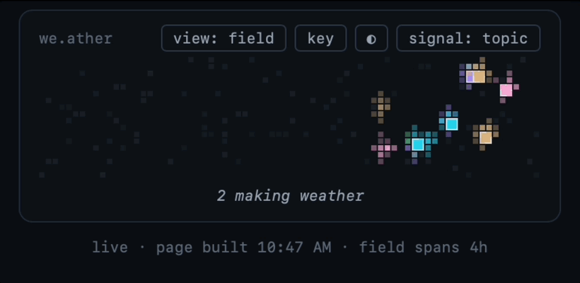

# we.ather

**Ambient social presence for AI-era work.** A small sticky widget that
lets rooms of 2–12 trusted people share low-resolution "work weather"
while they work with AI tools. Recreates the hum of working *near*
people, without fully sharing what anyone is actually saying or doing.

_Timelapse view of two people working in a shared board over several hours._

Your AI coding tools (Claude Code, Warp) already keep session logs on
your machine. we.ather reads only the project folders you explicitly
allow, distills them **locally** into a few words of state — a work
phase, a short topic phrase — and shares *only that* with your room,
through a tiny relay one member hosts on their own free Cloudflare
account. Color = kind of work, position = time. Hovering a fresh cloud
shows who it is and five words of what they're into. Everything else is
just weather.

No accounts, no central server, no feed, no metrics.

## Try it

- **Join or start a room** → download the latest package from
  [Releases](../../releases) and read the
  [Member Guide](docs/pilot-kit.md). Setup is ~10 minutes; a board of
  just yourself is fine to start.
- **Host your own board** (free, ~20 minutes, nothing routed through
  anyone) → [Self-Hosting Guide](docs/self-hosting.md).
- **"What exactly leaves my machine?"** →
  [Security Model](docs/security-model.md) — one page, and if the code
  and that page ever disagree, that's a bug: tell me.

Currently macOS + Claude Code, Warp, and/or Codex (newest — tell us
what breaks). Extraction runs on your own
Anthropic API key (~pennies/workday) or your existing Claude
subscription. Your choice at install.

## Status

As of July '26: Early beta. A small pilot has been running for weeks;
now expanding to a slightly wider circle of people running their own
boards. Interested? Open an issue or reach out —
[caitlinmorris.net](https://caitlinmorris.net).

The narrative version (why ambient presence matters, my research on
collaborative and social visibility, and how this design approaches it)
is on
[Substack](https://caitlinmaking.substack.com/p/weather-ambient-social-visibility).

## Research context

we.ather extends my work on calibrated social visibility in
collaboration (InquiryBits, CSCW) into AI-era work: people consistently
want *more* visibility to support connection and collaboration, and
firmly want it limited to small trusted groups. The design premise here
is that private work and peripheral visibility aren't inherently in
tension, they're just a design opportunity. Design principles, decision
memos, and a running lab notebook live in [docs/](docs/).

## License

[MIT](LICENSE).
